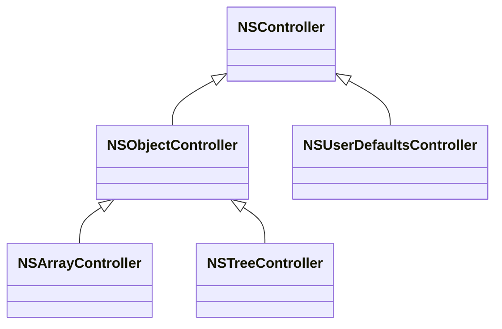

# HelloCocoaBinding
[TOC]

## 1、介绍Cocoa Binding

Cocoa Binding是一组技术集合，主要基于KVC、KVO以及Value Transformer等技术，将MVC中Controller和View连接起来，直观的感受是对数据的操作，会自动触发UI组件的刷新。

官方文档对Cocoa Binding描述，如下

> Cocoa bindings is a collection of technologies you can use in your applications to fully implement a Model-View-Controller paradigm where models encapsulate application data, views display and edit that data, and controllers mediate between the two. Cocoa bindings reduces the code dependencies between models, views and controllers, supports multiple ways of viewing your data, and automatically synchronizes views when models change. Cocoa bindings provides extensible controllers, protocols for models and views to adopt, and additions to classes in Foundation and the Application Kit. You can eliminate most of your glue code by using bindings available in Interface Builder to connect controllers with models and views.

Cocoa Binding的优势，有下面几个点

* 节省大量UI和Data之间的胶水代码，比如UI监听数据变更以及UI刷新等
* AppKit和Foundation内置一些类（比如NSObjectController、NSArrayController），直接适用于Cocoa Binding一些场景（比如数据选择、数据排序等），不用重复实现代码
* Interface Builder的UI组件，默认支持Cocoa Binding，实现一些简单Cocoa Binding场景，几乎不用写代码

说明

> 在MacOS上开发app，如果大量使用系统的组件，那么依赖Interface Builder来搭建UI是不错的选择

### (1) Cocoa Binding类

Cocoa Binding类有下面一些[^2]，如下

* NSController
* NSObjectController
* NSUserDefaultsController
* NSArrayController
* NSTreeController

它们的类继承关系，如下

## 2、

# References

[^1]:https://developer.apple.com/library/archive/documentation/Cocoa/Conceptual/CocoaBindings/CocoaBindings.html
[^2]:https://developer.apple.com/library/archive/documentation/Cocoa/Conceptual/CocoaBindings/Concepts/WhatAreBindings.html#//apple_ref/doc/uid/20002372-177085

