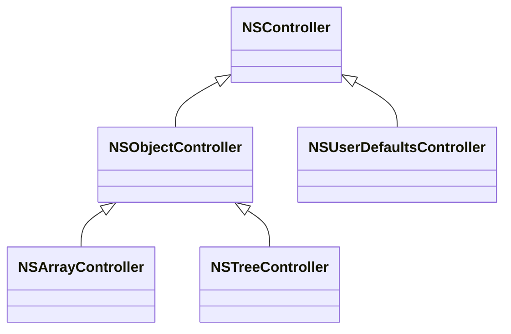
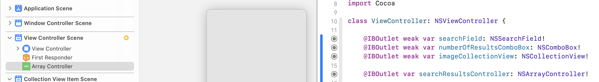
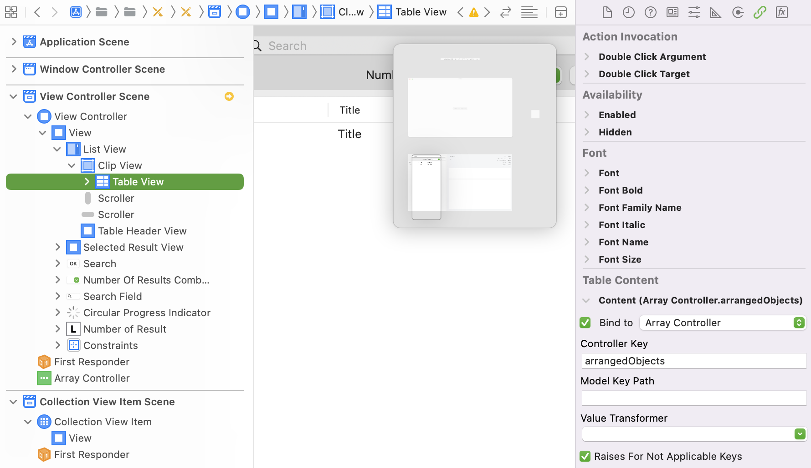
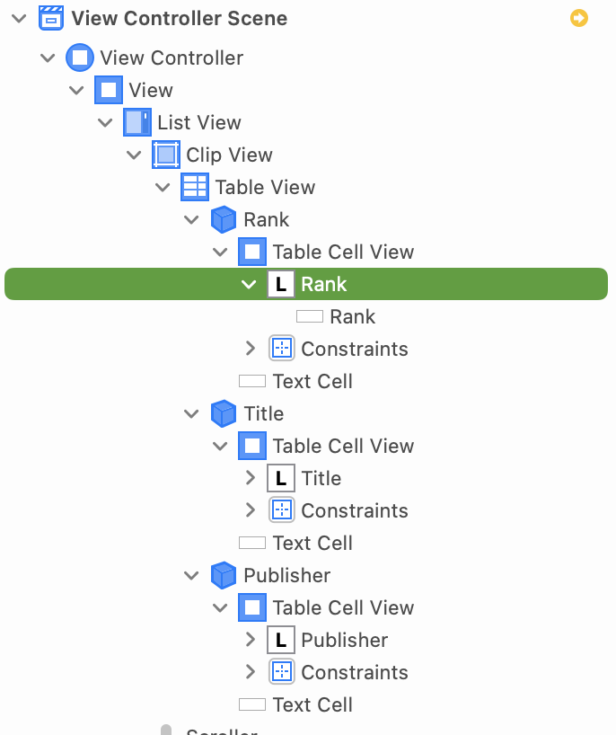
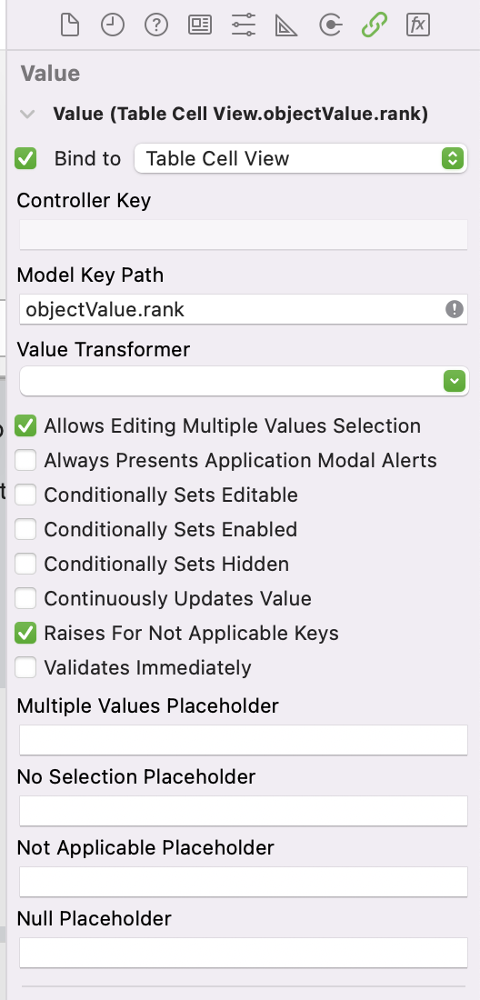
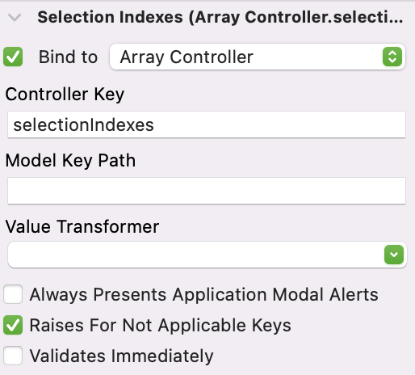
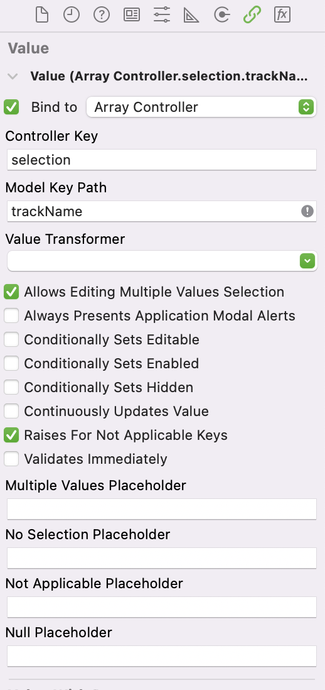
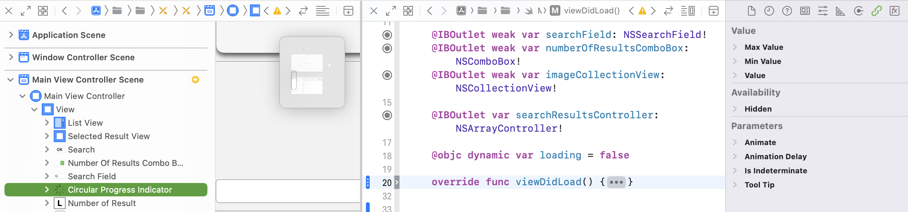
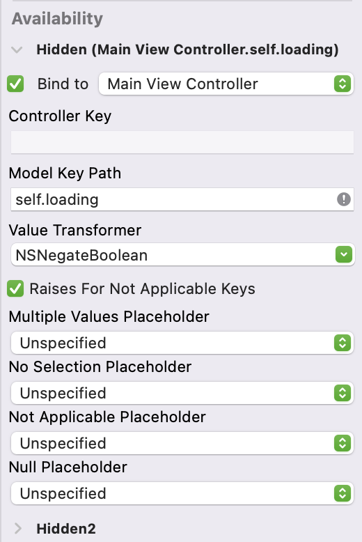
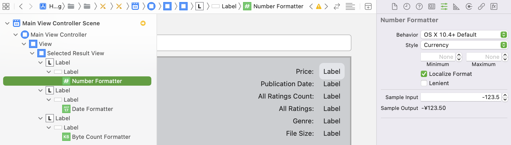

# HelloCocoaBinding
[TOC]

## 1、介绍Cocoa Binding

Cocoa Binding是一组技术集合，主要基于KVC、KVO以及Value Transformer等技术，将MVC中Controller和View连接起来，直观的感受是对数据的操作，会自动触发UI组件的刷新。

官方文档对Cocoa Binding描述，如下

> Cocoa bindings is a collection of technologies you can use in your applications to fully implement a Model-View-Controller paradigm where models encapsulate application data, views display and edit that data, and controllers mediate between the two. Cocoa bindings reduces the code dependencies between models, views and controllers, supports multiple ways of viewing your data, and automatically synchronizes views when models change. Cocoa bindings provides extensible controllers, protocols for models and views to adopt, and additions to classes in Foundation and the Application Kit. You can eliminate most of your glue code by using bindings available in Interface Builder to connect controllers with models and views.

Cocoa Binding的优势，有下面几个点

* 节省大量UI和Data之间的胶水代码，比如UI监听数据变更以及UI刷新等
* AppKit和Foundation内置一些类（比如NSObjectController、NSArrayController），直接适用于Cocoa Binding一些场景（比如数据选择、数据排序等），不用重复实现代码
* Interface Builder的UI组件，默认支持Cocoa Binding，实现一些简单Cocoa Binding场景，几乎不用写代码

说明

> 在MacOS上开发app，如果大量使用系统的组件，那么依赖Interface Builder来搭建UI是不错的选择


### (1) Cocoa Binding类

Cocoa Binding类有下面一些[^2]，如下

* NSController
* NSObjectController
* NSUserDefaultsController
* NSArrayController
* NSTreeController

它们的类继承关系，如下




## 2、常见UI组件Binding

### (1) NSTableView Binding

NSTableView可以不设置dataSource属性，通过将它的Table Content绑定到一个NSArrayController对象上，也可以完成列表的自动刷新。

基本步骤[^3]，如下

#### a. 创建NSArrayController的IBOutlet

在Interface Builder中创建一个NSArrayController，如下




#### b. 设置Table Content的binding

选中NSTableView，在Binding Inspector中，找到Table Content，勾选Bind to，并选择为Array Controller，如下



这里的Array Controller就是上面在Interface Builder中创建的Array Controller对象，然后设置Controller Key为arrangedObjects。

完成这个操作，就是把NSTableView的数据绑定到NSArrayController的arrangedObjects属性。

说明

> 1. Controller Key的含义是指某个控制器的属性，比如arrangedObjects是NSArrayController的属性
>
> 2. arrangedObjects属性，是KVO observable，而且arrangedObjects属性返回的数组是经过NSArrayController的arrange方法，有过滤和排序的能力


上面创建searchResultsController变量，如果获取到数据，则设置到它的content属性上，如下

```swift
self.searchResultsController.content = itunesResults
```

到这里，NSTableView能显示正确row的个数，但是每个row中cell是没有数据的，这是因为cell需要binding。

说明

> content属性是NSObjectController的属性，定义如下
>
> ```objective-c
> @property(strong) id content;
> ```
>
> 


#### c. 设置NSTextField的binding

NSTableCellView是NSTableView的每个cell，但是NSTableCellView还有它的子视图。

以cell显示文本为例，实际上是通过NSTextField显示文本，因此需要显示cell的内容，是需要绑定具体显示的UI组件。

例如NSTableView显示3列文本，分别Rank、Title和Publisher，如下



需要依次将对应的NSTextField设置好binding，以Rank为例，如下



找到Value，勾选Bind to，并选择Table Cell View，然后设置Model Key Path为objectValue.rank。

这里Binding操作和上面设置Table Content的binding不一样，这里没有直接绑定到Array Controller对象上，而绑定到每个NSTableCellView的objectValue属性上。

官方文档对objectValue属性描述，如下

> The `objectValue` is automatically set by the table when using bindings or is the object returned by the [`NSTableViewDataSource`](dash-apple-api://load?request_key=lc/documentation/appkit/nstableviewdatasource) protocol method [`tableView:objectValueForTableColumn:row:`](dash-apple-api://load?request_key=lc/documentation/appkit/nstableviewdatasource/1533674-tableview).

可见NSTableView设置好Binding，那么每个NSTableCellView的objectValue属性也会自动设置对应的数据对象，因此NSTextField需要的数据直接绑定到objectValue属性上。

objectValue属性返回的一个id类型，这个类型是Array Controller对象返回的数组中的元素类型。

在HelloCocoaBinding工程中，这个元素类型是Result类，它的定义，如下

```swift
class Result: NSObject {
    @objc dynamic var rank = 0
    @objc dynamic var artistName = ""
    @objc dynamic var trackName = ""
    @objc dynamic var averageUserRating = 0.0
    @objc dynamic var averageUserRatingForCurrentVersion = 0.0
    @objc dynamic var itemDescription = ""
    @objc dynamic var price = 0.00
    @objc dynamic var releaseDate = Date()
    @objc dynamic var artworkURL: URL?
    @objc dynamic var artworkImage: NSImage?
    @objc dynamic var screenShotURLs: [URL] = []
    @objc dynamic var screenShots = NSMutableArray()
    @objc dynamic var userRatingCount = 0
    @objc dynamic var userRatingCountForCurrentVersion = 0
    @objc dynamic var primaryGenre = ""
    @objc dynamic var fileSizeInBytes = 0
    @objc dynamic var cellColor = NSColor.white
    ...
}
```

说明

> 1. @objc TODO
> 2. dynamic TODO

同样的操作，将Title和Publisher设置好binding，它们的Model Key Path为

* objectValue.trackName
* objectValue.artistName

到这里NSTableView，应该能显示所有的cell数据。


#### d. 设置NSTableView的selection binding

对NSTableView的选中row进行数据绑定，这里对row的选中可以是仅一行，也可以是多行。

在NSTableView的Binding Inspec中找到Selection Indexes，勾选Bind to，并选择Array Controller对象，然后设置Controller Key为selectionIndexes。



说明

> NSArrayContoller的selectionIndexes属性，用于表示数组中被选中元素的下标。
>
> 官方文档描述，如下
>
> An index set containing the indexes of the receiver’s currently selected objects in the content array

完成上面的绑定操作后，当NSTableView中row被选中时，会自动更新NSArrayContoller的selectionIndexes属性，同时也会更新它的selection属性。

说明

> selection属性是NSObjectController的属性，NSArrayContoller继承自NSObjectController


如果其他UI组件要监听NSTableView的选中row的事件，以选中一行为例。

可以它的Binding Inspector去绑定NSArrayContoller的selection属性，如下



这里还需要设置Model Key Path，即选中的某个模型的trackName字段。


### (2) hidden属性 binding

上面NSTableView的数据绑定，由于数据和UI都比较复杂，所以绑定操作的步骤比较多。

如果是简单的UI属性绑定到某个变量，绑定操作的步骤则相对比较少。

以某个View的hidden属性的绑定为例，如下



新建一个变量loading，用于UI监听这个变量的数据变更。然后在Interface Builder中，选中Indicator，找到Binding Inspector的Hidden设置，如下



由于需要将监听的值取反，这里直接使用Value Transformer中的NSNegateBoolean


### (3) 数据转换

#### a. 使用Formatter对象

在Interface Builder中可以在NSTextFieldCell下面添加Formatter对象，数据显示时会自动该Formatter对象进行数据格式化，如下




# References

[^1]:https://developer.apple.com/library/archive/documentation/Cocoa/Conceptual/CocoaBindings/CocoaBindings.html
[^2]:https://developer.apple.com/library/archive/documentation/Cocoa/Conceptual/CocoaBindings/Concepts/WhatAreBindings.html#//apple_ref/doc/uid/20002372-177085
[^3]:https://www.raywenderlich.com/921-cocoa-bindings-on-macos


