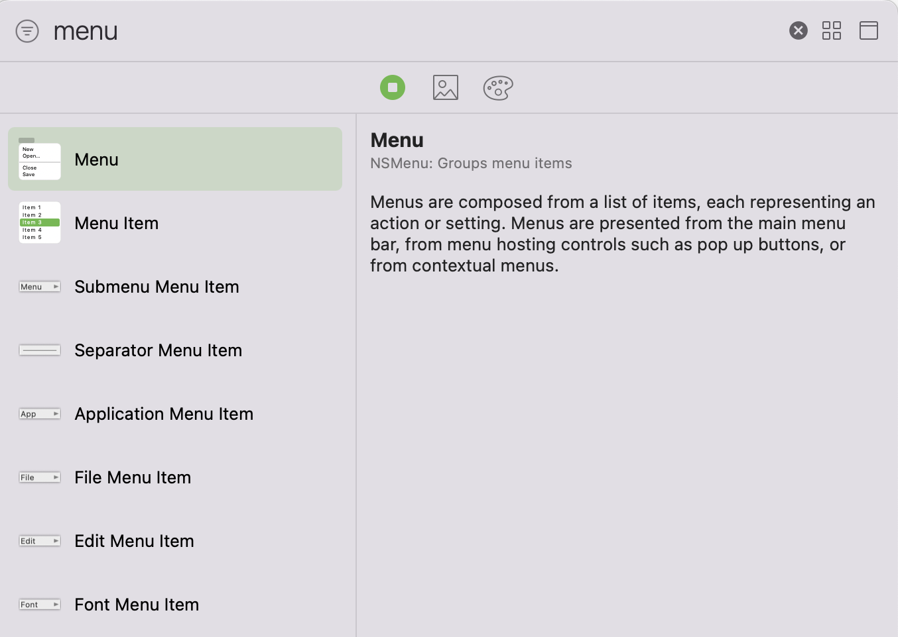
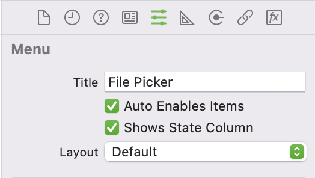
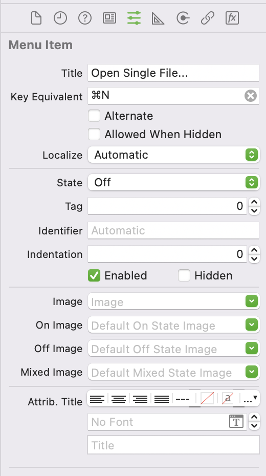
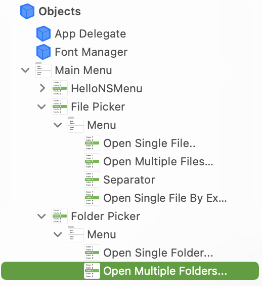
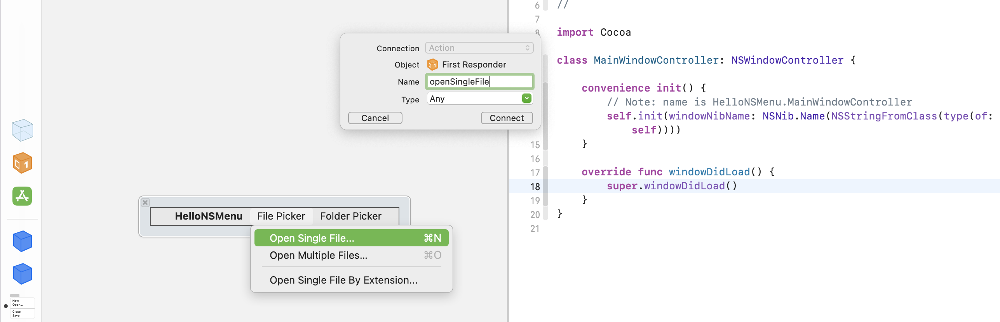

# HelloNSMenu

[TOC]

## 1、创建Main Menu的菜单

### (1) Main Menu的结构

Main Menu是每个MacOS app的主菜单，当使用MacOS app模板创建一个Xcode工程时，默认会有一个Main Menu的object，它对应的类是NSMenu。Main Menu对象和可视化界面，如下


说明

> 在Interface Builder中Main Menu的每个菜单都是正常显示的，但是实际运行会发现某些菜单按钮是灰色的，这是因为这个按钮没有配置对应的IBAction[^1]

通过左侧Main Menu的树形结构，可以了解到

* Main Menu (NSMenu)下面有多个NSMenuItem，比如File菜单
* 每个NSMenuItem（比如File菜单）下面会有一个NSMenu，它用于组合这个NSMenuItem下面的所有子菜单

用下面图示例NSMenu和NSMenuItem关系，如下

```
NSMenu (Main Menu)
|--NSMenuItem (File)
|  |--NSMenu
|     |--NSMenuItem (New)
|     |--NSMenuItem (Open...)
|     |--NSMenuItem (Open Recent)
|     |   |--NSMenu
|     |      |--NSMenuItem (Clear Menu)
|     |      |--NSMenuItem (Open Recent)
|     |--NSMenuItem (Separator)
|     |--NSMenuItem (Close)
|--NSMenuItem (Edit)
```

总结归纳一下

* NSMenu是一个菜单组的概念，而NSMenuItem是具体某个菜单按钮
* NSMenuItem可以是某个菜单按钮，也可以是一个分割线
* NSMenu和NSMenuItem相互嵌套，组成菜单——子菜单——子子菜单……


### (2) 创建NSMenu和NSMenuItem

创建NSMenu和NSMenuItem，可以通过+Library，新建多种类型的NSMenu和NSMenuItem，也可以删除多余的默认NSMenu和NSMenuItem。




#### a. 配置NSMenu的标题




#### b. 配置NSMenuItem的标题




说明

> 配置NSMenu和NSMenuItem的标题，并不会修改对应object的名字，因此需要在Objects一栏下面手动修改对应NSMenu和NSMenuItem对象的名字，如下图
>
> 


### (3) 创建NSMenuItem的IBAction

在Interface Builder中选中某个NSMenuItem，然后按住Ctrl键，拖拽该按钮到右侧的代码文件中，提示Insert Action后，松开手，如下图



然后填写IBAction的方法名，点击Connect，这样自动建立按钮对应的IBAction方法。


## 2、使用NSOpenPanel

举个例子[^2]，如下

```swift
@IBAction func openSingleFile(_ sender: Any) {
    let dialog = NSOpenPanel();

    dialog.title                   = "Choose a file| Our Code World";
    dialog.showsResizeIndicator    = true;
    dialog.showsHiddenFiles        = false;
    dialog.allowsMultipleSelection = false;
    dialog.canChooseDirectories = false;

    if (dialog.runModal() ==  NSApplication.ModalResponse.OK) {
        let result = dialog.url // Pathname of the file

        if (result != nil) {
            let path: String = result!.path
            print("You selected path: \(path)")
            // path contains the file path e.g
            // /Users/ourcodeworld/Desktop/file.txt
        }

    } else {
        // User clicked on "Cancel"
        print("You clicked on \"Cancel\"")
        return
    }
}
```


## References

[^1]:https://www.appcoda.com/macos-programming-menus-toolbar/
[^2]:https://ourcodeworld.com/articles/read/1117/how-to-implement-a-file-and-directory-picker-in-macos-using-swift-5


