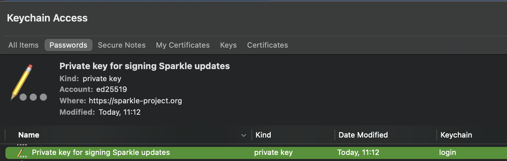
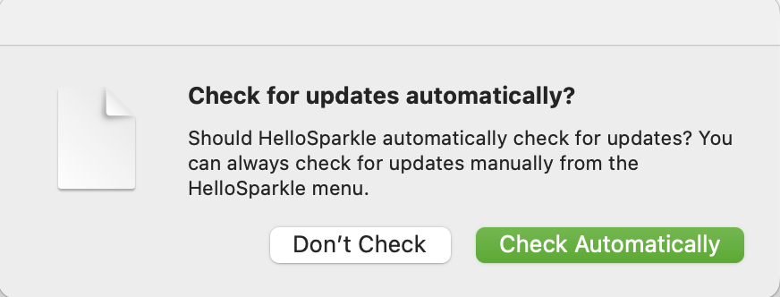
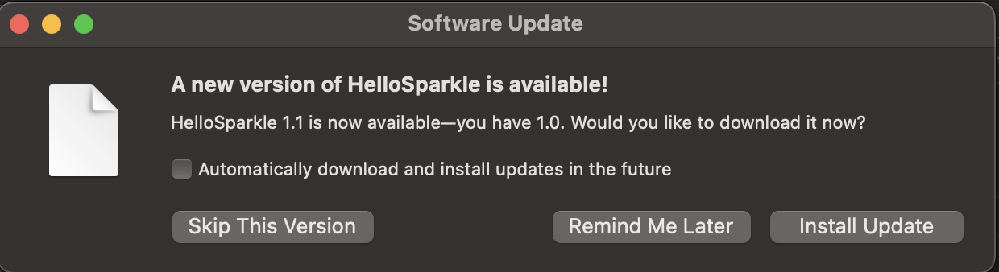

# HelloSparkle

[TOC]

## 1、介绍Sparkle

Sparkle是macOS上一个更新软件的框架。官方文档描述[^1]，如下

> Secure and reliable software update framework for macOS.

github地址：https://github.com/sparkle-project/Sparkle

使用文档：https://sparkle-project.org/documentation/


### (1) 安装Sparkle

Sparkle支持下面几种集成方式，如下

* SPM (Swift Package Manager)
* CocoaPods
* Carthage
* 手动集成（Xcode工程内置framework）

这里以CocoaPods集成为例

在Podfile中，设置如下

```ruby
source 'https://cdn.cocoapods.org/'

platform :osx, '11.0'

target 'HelloSparkle' do
  pod 'Sparkle', '2.1.0'
end
```

使用静态库或动态库集成都可以。


### (2) 设置SPUStandardUpdaterController

参考官方文档[^2]的步骤，如下

> - Open up your MainMenu.xib.
> - Choose View › Show Library…
> - Type “Object” in the search field under the object library and drag an Object into the left sidebar of the document editor.
> - Select the Object that was just added.
> - Choose View › Inspectors › Identity.
> - Type `SPUStandardUpdaterController` in the Class box of the Custom Class section in the inspector.
> - If you’d like, make a “Check for Updates…” menu item in the application menu; set its target to the `SPUStandardUpdaterController` instance and its action to `checkForUpdates:`.

可以在XIB中配置一个菜单按钮，用于检查更新。

这里使用代码方式作为示例，如下

```swift
import Sparkle

@main
class AppDelegate: NSObject, NSApplicationDelegate {
    lazy var updaterController: SPUStandardUpdaterController = SPUStandardUpdaterController(startingUpdater: true, updaterDelegate: nil, userDriverDelegate: nil)

    func applicationDidFinishLaunching(_ aNotification: Notification) {
        self.setupCheckForUpdates()
	      ...
    }
  
    // MARK:
    func setupCheckForUpdates() -> Void {
        self.checkForUpdatesItem.target = self.updaterController
        self.checkForUpdatesItem.action = #selector(SPUStandardUpdaterController.checkForUpdates(_:))
    }
}
```

这里懒加载初始化SPUStandardUpdaterController对象，将让AppDelegate对象持有它，这个对象用于响应菜单checkForUpdatesItem的点击事件。


### (3) 配置Info.plist

Sparkle提供一些自定义Key可以配置在Info.plist中，官方文档见：https://sparkle-project.org/documentation/customization/。这里介绍一些必填和常用的key。


#### a. 配置SUPublicEDKey (必填)

SUPublicEDKey用于配置EdDSA的公钥，使用generate_keys工具可以生成。

在Pods中找到Sparkle文件夹，如下

```shell
$ cd path/to/HelloSparkle/Pods/Sparkle
$ ./bin/generate_keys 
Generating a new signing key. This may take a moment, depending on your machine.
A key has been generated and saved in your keychain. Add the `SUPublicEDKey` key to
the Info.plist of each app for which you intend to use Sparkle for distributing
updates. It should appear like this:

    <key>SUPublicEDKey</key>
    <string>gV2YaGTVamTS2dlFbt0dzuNFNHwHwWEhPnSzX2fzj3A=</string>
```

执行上面命令，会自动生成一对公私钥，公钥已经在Terminal中提示，而私钥存在Keychain Access中，如下



该私钥的账户是ed25519，执行generate_keys --help命令查看具体用法，可以指定账户。


#### b. 配置SUFeedURL (必填)

SUFeedURL用于配置url地址，类似https://yourcompany.example.com/appcast.xml，下载appcast.xml文件。Sparkle会读取appcast.xml的版本，和当前app的CFBundleVersion，进行版本比较。

说明

> appcast.xml可以使用generate_appcast命令行工具生成，不用手写。


#### c. 配置SUEnableAutomaticChecks (可选)

不配置SUEnableAutomaticChecks，默认会自动出现一个提示框，让用户选择是否自动检查更新，如下



可以设置SUEnableAutomaticChecks=YES，让应用程序默认自动检查更新，则不会有这个提示框。


### (4) 配置app网络权限

如果没有配置网络权限，Sparkle请求更新包，Xcode console会报错，如下

```shell
2023-10-14 20:21:36.569610+0800 HelloSparkle[11859:115522] [] networkd_settings_read_from_file Sandbox is preventing this process from reading networkd settings file at "/Library/Preferences/com.apple.networkd.plist", please add an exception.
...
2023-10-14 20:21:36.655234+0800 HelloSparkle[11859:116170] Task <4772EE64-CAB2-45D6-B4C0-7B58804A085B>.<1> finished with error [-1003] Error Domain=NSURLErrorDomain Code=-1003 "A server with the specified hostname could not be found." UserInfo={_kCFStreamErrorCodeKey=-72000, NSUnderlyingError=0x600000074030 {Error Domain=kCFErrorDomainCFNetwork Code=-1003 "(null)" UserInfo={_NSURLErrorNWPathKey=satisfied (Path is satisfied), interface: en0[802.11], ipv4, ipv6, dns, _kCFStreamErrorCodeKey=-72000, _kCFStreamErrorDomainKey=10}}, _NSURLErrorFailingURLSessionTaskErrorKey=LocalDownloadTask <4772EE64-CAB2-45D6-B4C0-7B58804A085B>.<1>, _NSURLErrorRelatedURLSessionTaskErrorKey=(
    "LocalDownloadTask <4772EE64-CAB2-45D6-B4C0-7B58804A085B>.<1>"
), NSLocalizedDescription=A server with the specified hostname could not be found., NSErrorFailingURLStringKey=https://raw.githubusercontent.com/daydreamboy/HelloMacOSApp/master/downloads/appcast.xml, NSErrorFailingURLKey=https://raw.githubusercontent.com/daydreamboy/HelloMacOSApp/master/downloads/appcast.xml, _kCFStreamErrorDomainKey=10}
```

解决方法：在Xcode的Signing & Capabilities > App Sandbox中勾选Outgoing Connection (Client)


### (5) 发布app包和appcast.xml

Sparkle支持下面几种形式发布app，如下

* zip包
* tarball（例如tar.xz）
* dmg镜像文件
* 安装包pkg

Sparkle推荐使用zip包或者tarball

官方文档描述[^2]，如下

> Sparkle supports updating from ZIP archives, tarballs, disk images (DMGs), and installer packages. While you can reuse the same archive for distribution of your app on your website, we recommend serving ZIPs or tarballs (e.g. tar.xz) for updates because they are the fastest and most reliable formats for Sparkle.

这里以发布zip包为例。执行下面几个步骤

* 使用Xcode编译Release版本的app。有几种方式
  * 使用xcodebuild archive和xcodebuild -exportArchive，导出一个`.app`包
  * 直接编译`.app`包

* 将`.app`放入单独的文件夹，然后压缩这个文件夹
  * 注意这个文件夹，下面除了`.app`不能有其他文件和文件夹
* 使用`"Pods/Sparkle/bin/generate_appcast "path/to/Update`
  * Update文件夹仅包含一个zip文件
  * 添加`--account`参数，可以指定用哪个私钥
  * 执行成功后，Update文件夹会多出一个appcast.xml文件
* 将zip和xml上传到可供下载的地方

可以使用脚本自动化完整上面的步骤。有2种方式

* 使用独立的脚本
* 使用Xcode的Run Script脚本

这里使用第二种方式，见HelloSparkle/HelloSparkle/RunScripts/pack.sh脚本。

如果当前app的版本低于appcast.xml中的版本，则在app检查更新（自动检查或者手动检查）后，会自动弹出下面提示，如下




## 2、常见问题

### (1) Xcode Console提示Serving updates without an EdDSA key and only using Apple Code Signing is deprecated and may be unsupported in a future release.

Xcode Console提示，如下

```shell
2023-10-11 11:49:49.849844+0800 HelloSparkle[30734:244100] [Sparkle] Error: Serving updates without an EdDSA key and only using Apple Code Signing is deprecated and may be unsupported in a future release. Visit Sparkle's documentation for more information: https://sparkle-project.org/documentation/#3-segue-for-security-concerns
```

解决方法：Info.plist缺少SUPublicEDKey，添加这个key


### (2) 下载更新报错“The update is improperly signed and could not be validated. Please try again later or contact the app developer.”

原因：检查更新包的签名不对

解决方法：检查本地Keychain Access的私钥是否正确，检查该私钥对应的公钥，是否和Info.plist的SUPublicEDKey是否一致。

导出本地私钥和公钥，执行下面命令，如下

```shell
# 查看公钥
$ ./generate_keys -p    
zN8wNUgNoYGew4k6bI/Wzy2PjVg6Z7wb9L7T2yiEDic=
# 导出私钥文件
$ ./generate_keys -x private-key-file 
```


### (3) 如何将本地私钥导出，用于其他mac电脑打包

参考官方文档[^2]下面这段话，如下

> Here is an example run of `./bin/generate_keys`:
>
> ```
> A key has been generated and saved in your keychain. Add the `SUPublicEDKey` key to
> the Info.plist of each app for which you intend to use Sparkle for distributing
> updates. It should appear like this:
> 
>     <key>SUPublicEDKey</key>
>     <string>pfIShU4dEXqPd5ObYNfDBiQWcXozk7estwzTnF9BamQ=</string>
> ```
>
> You can use the `-x private-key-file` and `-f private-key-file` options to export and import the keys respectively when transferring keys to another Mac. Otherwise we recommend keeping the keys inside your Mac’s keychain. Be sure to keep them safe and not lose them (they will be erased if your keychain or system is erased).

* 使用命令`./bin/generate_keys -x private-key-file`，导出私钥到private-key-file文件中
* 使用命令`./bin/generate_keys -f private-key-file`，将private-key-file文件的私钥导入到Keychain Access中


### (4) 如何使用多个公私钥对打包

如果有多个app打包的需求，可以使用账户来隔离多个公私钥对。使用`--account`参数。

* 生成公私钥对，如下

```shell
./bin/generate_keys --account HelloSparkle 
Generating a new signing key. This may take a moment, depending on your machine.
A key has been generated and saved in your keychain. Add the `SUPublicEDKey` key to
the Info.plist of each app for which you intend to use Sparkle for distributing
updates. It should appear like this:

    <key>SUPublicEDKey</key>
    <string>MhfHFaB0dpZSR53yn7AkkZpk8U4w8xKdsN+FNkkYy/s=</string>
```

* 使用私钥，如下

```shell
"${PROJECT_DIR}"/Pods/Sparkle/bin/generate_appcast "${PROJECT_DIR}"/${package_folder}/Update --account ${account_name}
```


### (5) 如何设置每次app启动检查更新

在app启动之前，删除UserDefaults中的SULastCheckTime，这样每次app启动都会检查更新。

示例代码，如下

```swift
func applicationWillFinishLaunching(_ notification: Notification) {
    UserDefaults.standard.removeObject(forKey: "SULastCheckTime")
}
```

参考官方文档描述[^2]，如下

> To test automatic update checks immediately, run `defaults delete my-bundle-id SULastCheckTime` to clear the last update check time before launching the app.


## (6) Sparkle更新失败

解决方法：打开Console，过滤Process和Error，查看报错日志。


## References

[^1]:https://github.com/sparkle-project/Sparkle
[^2]:https://sparkle-project.org/documentation/


