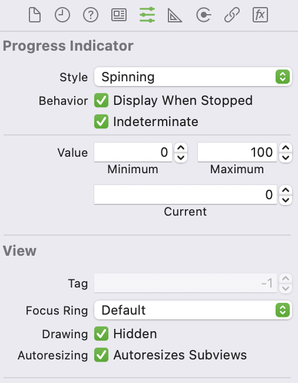

# HelloMacOSApp
[TOC]

## 1、使用AppKit

### (1) Class Hierarchy 

NSWindowController

NSViewController

NSSplitViewController

NSTabViewController

TODO


NSTableView

https://medium.com/@kicsipixel/very-simple-view-based-nstableview-in-swift-5-using-model-134c5f4c12ee


add constraints

https://stackoverflow.com/a/66386655

https://developer.apple.com/library/archive/documentation/UserExperience/Conceptual/AutolayoutPG/WorkingwithConstraintsinInterfaceBuidler.html


AppKit

https://developer.apple.com/documentation/appkit


file/direcotry picker

https://ourcodeworld.com/articles/read/1117/how-to-implement-a-file-and-directory-picker-in-macos-using-swift-5


### (2) 常用UI组件


| 类                  | UI组件      | 作用                    |      |
| ------------------- | ----------- | ----------------------- | ---- |
| NSProgressIndicator | loading组件 | 有2个样式：转圈和进度条 |      |
| NSSearchField       | 搜索框      |                         |      |
|                     |             |                         |      |


## 2、常见问题

### (1) MacOS app无法访问网络

新建的MacOS app工程，没有Info.plist文件可以设置，在App Sandbox设置[^1]，如下


### (2)  NSProgressIndicator显示没有动画

解决方法：将Drawing勾选Hidden[^2]，如下




如果是使用代码实现，则设置如下

```objective-c
- (IBAction)startAction:(id)sender {
    [progressBar setHidden:NO];
    [progressBar setIndeterminate:YES];
    [progressBar setUsesThreadedAnimation:YES];
    [progressBar startAnimation:nil];
}
```


## References

[^1]:https://stackoverflow.com/a/57292829
[^2]:https://stackoverflow.com/questions/14861373/indeterminate-nsprogressindicator-will-not-animate

